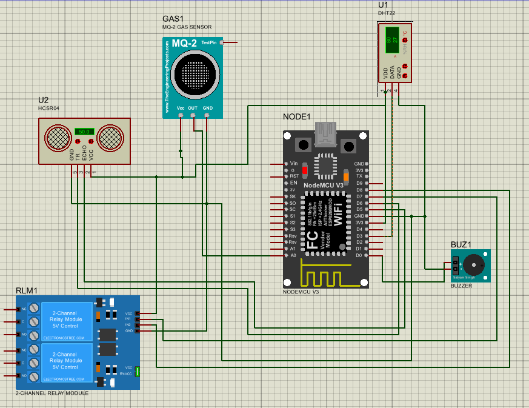

# SafeNest 🏠

A full-stack smart home automation system built during a summer internship at **Alfa Computers & Consulting (2024)**.
SafeNest allows users to monitor environmental sensor data in real time and control smart devices remotely via a mobile app.

---

## System Architecture

```
[ESP8266 Hardware] ──HTTP──▶ [Node.js REST API] ──▶ [MongoDB]
                                      ▲
                              [React Native App]
```

The system is composed of three layers:
- **Hardware layer** — NodeMCU ESP8266 reads sensor data and sends it to the cloud
- **Backend layer** — Node.js REST API with JWT authentication and MongoDB storage
- **Mobile layer** — React Native app for real-time monitoring and LED control

---

## Features

- 📡 Real-time environmental monitoring (temperature, humidity, gas level, water level)
- 💡 Remote LED control via mobile app
- 🔐 User authentication with JWT tokens and role-based access (admin/user)
- 📊 Sensor event logging with timestamps stored in MongoDB
- 📱 Cross-platform mobile interface built with React Native (Expo)

---

## Project Structure

```
SafeNest/
├── hardware/
│   └── smartnest.ino        # ESP8266 firmware (sensors + WiFi + HTTP)
├── api/                     # Node.js REST API
│   └── src/
│       ├── authentication/  # JWT login & registration
│       ├── command/         # LED control endpoints
│       ├── event/           # Sensor event model & routes
│       ├── user/            # User management
│       └── config/          # MongoDB connection
└── app/                     # React Native mobile app (Expo)
    └── src/
        ├── screens/         # App screens (Home, Login, LED control...)
        ├── hooks/           # API integration hooks
        └── components/      # Reusable UI components
```

---

## Circuit Schematic



---

## Hardware — ESP8266 Firmware

**Board:** NodeMCU ESP8266  
**Sensors used:**

| Sensor | Pin | Measures |
|--------|-----|----------|
| DHT22 | D3 | Temperature & Humidity |
| MQ-2 | A0 | Gas / Smoke level |
| HC-SR04 (Ultrasonic) | D5, D6 | Water level (distance) |
| Relay module | D7, D8 | Device on/off control |

The firmware connects to WiFi, reads all sensors every 10 seconds, and sends JSON payloads to the API via HTTP POST.

---

## Backend — Node.js API

**Tech stack:** Node.js, Express.js, MongoDB, Mongoose, JWT

**Main endpoints:**

| Method | Route | Description |
|--------|-------|-------------|
| POST | `/api/auth/register` | Register a new user |
| POST | `/api/auth/login` | Login and receive JWT token |
| POST | `/api/events` | ESP8266 posts sensor data here |
| GET | `/api/events` | Retrieve sensor event history |
| POST | `/api/command/led` | Send LED on/off command |

---

## Mobile App — React Native (Expo)

**Tech stack:** React Native, Expo, JavaScript

**Screens:**
- **Get Started** — onboarding screen
- **Login / Register** — authentication screens
- **Home** — real-time sensor dashboard
- **Inside / Outside** — room-specific monitoring views
- **LED Control** — toggle connected devices remotely

---

## Setup & Installation

### 1. Hardware
1. Flash `hardware/smartnest.ino` to your NodeMCU ESP8266 using Arduino IDE
2. Install required libraries: `ESP8266WiFi`, `DHT`, `ArduinoJson`, `ESP8266HTTPClient`, `TimeLib`
3. Update WiFi credentials and API server URL in the sketch

### 2. Backend API
```bash
cd api
npm install
# Create a .env file with your MongoDB URI and JWT secret
npm start
```

### 3. Mobile App
```bash
cd app
npm install
npx expo start
```

---

## Demo

| Home Screen | LED Control | Sensor Data |
|-------------|-------------|-------------|
|  |  |  |

---

## Built With


---

## Authors

- **Lina Jbara** — Hardware (ESP8266 firmware), system integration
- **Mohamed Ben Naima** — Backend API, React Native mobile app

---

## License

This project was developed as part of a professional internship. All rights reserved.
